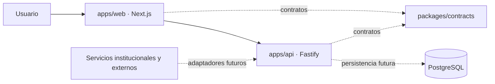

# Arquitectura inicial

## Estado

Esta arquitectura es un **punto de partida técnico**, no el diseño final solicitado por el curso. El modelo de datos y los componentes del enunciado siguen siendo preliminares y deben validarse en los documentos oficiales de las unidades.

## Límites actuales

### `apps/web`

Responsable de la interfaz y experiencia web. Solo contiene una pantalla de verificación y un endpoint de salud. Las funcionalidades futuras deberían organizarse por área del producto, no por tipo genérico de archivo.

### `apps/api`

Responsable de casos de uso, validación de entrada, autorización e integración con persistencia o servicios externos. Solo expone `GET /health`; no contiene lógica del dominio.

### `packages/contracts`

Punto para tipos y contratos compartidos entre web y API. Debe mantenerse pequeño y no depender de las aplicaciones.

### `infra/database`

Reserva el lugar para migraciones reproducibles una vez que el equipo valide el modelo y elija una herramienta. `compose.yaml` solo levanta PostgreSQL; la API aún no se conecta.

## Dirección de dependencias

- Las aplicaciones pueden depender de paquetes compartidos.
- Los paquetes compartidos nunca deben importar desde `apps/`.
- La web no accede directamente a la base de datos.
- Las integraciones externas se aíslan detrás de adaptadores en la API.
- Las decisiones estructurales se registran como ADR.

## Calidad y operación

Turborepo coordina compilación, lint, tipos y pruebas. GitHub Actions reproduce `pnpm check` en cada pull request. Las aplicaciones tienen endpoints de salud separados para facilitar verificaciones y futuros despliegues.

## Decisiones pendientes

- Modelo y herramienta de persistencia.
- Autenticación única y autorización por proyecto/rol.
- Editor de texto enriquecido e inserción de imágenes.
- Generación de PDF desde HTML.
- Historial inmutable y recuperación de versiones.
- Integración con Educandus.
- Encuestas, donaciones y otros servicios externos.
- Estrategia de despliegue, observabilidad, respaldo y recuperación.

Cada elección debe partir de requisitos validados, comparar alternativas y quedar registrada en `docs/adr/`.
